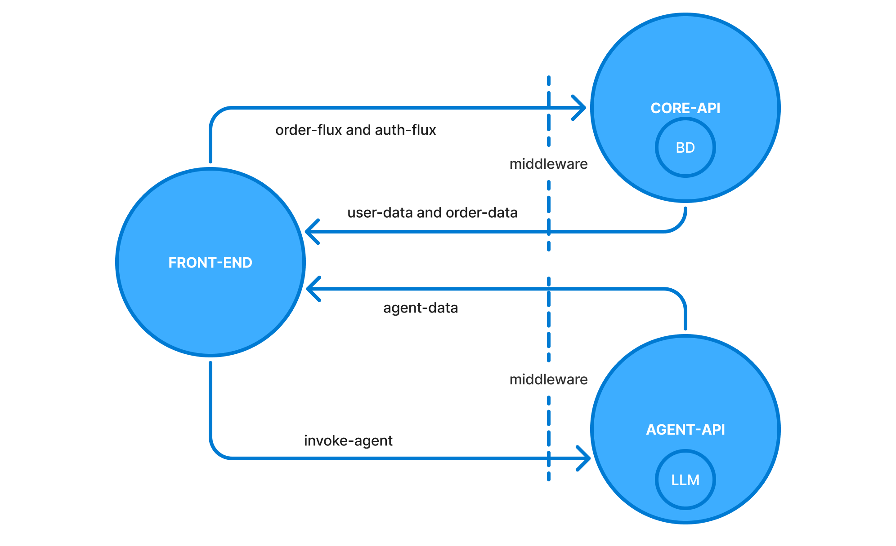

# 🤖 Desafio Cogniia

Este repositório contém a solução para o desafio técnico proposto pela Cognia. O objetivo deste desafio é demonstrar habilidades técnicas, boas práticas de desenvolvimento e a capacidade de criar uma arquitetura escalável e bem documentada.

## 🌐 Como acessar o projeto?
Abra cada um dos repositórios abaixo e realize as tarefas descritas no readme.md.

- **Frontend**
-- [Repositório](https://github.com/thiago-dsd/fastfood-frontend)
-- O frontend é a interface do usuário, desenvolvida com React e NextJS. Ele consome as API'S para exibir e manipular dados.

- **Core-API**: 
-- [Repositório](https://github.com/thiago-dsd/fastfood-core-api)
-- A Core-API é o núcleo da aplicação, responsável por gerenciar a lógica de negócio, autenticação e integração com o banco de dados. Foi desenvolvida em Golang com Fiber.

- **Agent-API**: 
-- [Repositório](https://github.com/thiago-dsd/fastfood-agent-api)
-- A Agent-API gerencia um agente inteligente desenvolvido com LangGraph e integrado a LLMs, utilizando Python e FastAPI para execução eficiente de tarefas de IA e automação de fluxos.

## 🏗️ Arquitetura

## 🙏 Agradecimentos
Gostaria de agradecer à equipe da Cognia pela oportunidade de participar deste desafio. Foi uma experiência enriquecedora e desafiadora, que me permitiu colocar em prática conhecimentos técnicos e boas práticas de desenvolvimento.

Agradeço também à comunidade de desenvolvedores e às fontes de conhecimento que me ajudaram a construir esta solução.